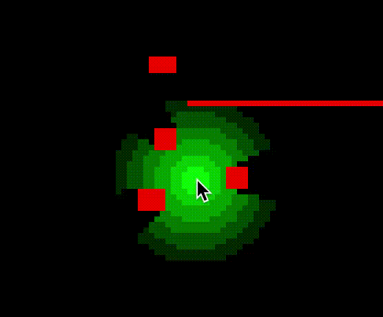

# light

A simple shadow-casting demo in Rust.



## Building & running

```sh
$ cargo run
```

## Controls

| Control                        | Action          |
| ------------------------------ | --------------- |
| <kbd>Left click</kbd> and drag | Create obstacle |
| <kbd>Right click</kbd>         | Delete obstacle |
| Move mouse                     | Control light   |
